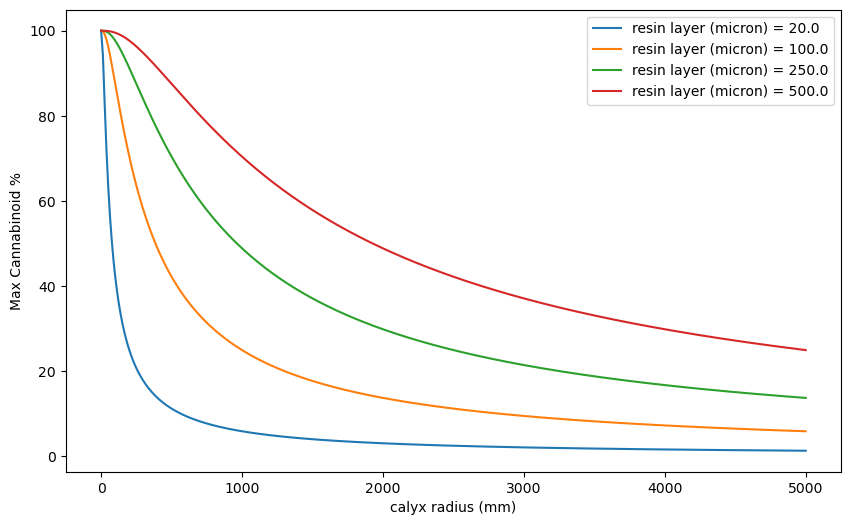

# core-shell-thc

## Abstract

The maximum achieveble potency of the Cannabis sativa plant is a hotly debated topic because of its importance to regulators and consumers. Accusations of potency inflation abound. However, there is not yet a simple model for estimating potency from physical dimensions. This repository is my first attempt at making a physical model of potency in cannabis. Preliminary results indicate an upper limit of >30% cannabinoids is reasonable.

## Introduction

Cannabis for personal consumption is subject to potency and safety testing in the USA and Canada. Allegations of potency inflation at producing sites and laboratories abound in both countries [ref-yasha-2024]. The debate is will continue until standard results taken using high performance liquid chromatography (HPLC) can be verified by a second, independent method. 

Here we describe a core-shell model of the Cannabis buds to predict a theoretical maximum from physically measurable parameters like calyx diameter and trichome length. The core is a sphere of plant material, the calyx. The shell is a solid layer of cannabinoids, the resin. When testing labs report the potency of marijuana, they report the mass fraction of cannabinoids in the total sample mass. We must therefore calculate the total mass and the fraction of that mass in the resin shell.

This model is limited to predicting the maximum total cannabinoids because it neglects to consider the gaps between trichomes in the resin layer. We expect to see voids between trichomes and trichome heads that will reduce ultimate potency.

## Methods

The volume fraction of a shell with outer radius Ro around a core of radius Rc is given by eqn 1

Eqn 1: V_shell / V_total = (Ro^3 - Rc^3) / Ro^3

Let delta = (Ro-Rc) be the thickness of the resin layer. The maximum this value could possibly take is the length of a trichome, i.e. the stalk length and head diameter. Delta can be found in literature [ref-punja-2023]. Stalk lengths can range from 0-1200 micron, but usually are 200-700 micron. Trichome head diameters range from 20-120um, but on average are 50-100 micron. This places a reasonable limit of 50-1200 micron for the resin layer, with a nominal thickness of 500um.  Calyx diameter are estimated from light microscopy images and range from 1 cm to 5 cm

## Results

A juptyer notebook to generate an interactive figure is given in this repository.

Using nominal values of delta = 500 micron and Rc = 2500 micron, Ro = 3000 micron yields an upper limit of 42%, as shown in Figure 1

Trends of potency vs calyx radius are predicted for various resin layer thicknesses in Figure 2.

A contour plot of potency vs calyx radius and trichome length is given in Figure 3, notably reproducing the market landscape by varying the parameters around known product parameters. 

## Discussion

This model predicts volume ratios, not mass ratios. Resin is more dense than calyx, so the mass ratios will be higher than the predicted volume ratios. However, this reseracher needs good values for the density of resin and calyx material to make those calculations.

The model predicts a higher maximum than other studies that contemplate the problem fro a biochemical point of view. That is unsurprising because the assumption of a solid resin layer is notably unrealistic. Further elaborations on the model were explored, but were found to reduce to the spherical model. Both ellipsoidal and conical calyx were explored, neither of which offered advantages because the formula reduced to eqn 1. The model reproduced the general range of potency reported in the market when using average parameters, lending hope that this heretofore untested model is accurate.

The model now needs to be tested with a set of known calyx, trichome, and potency results.

